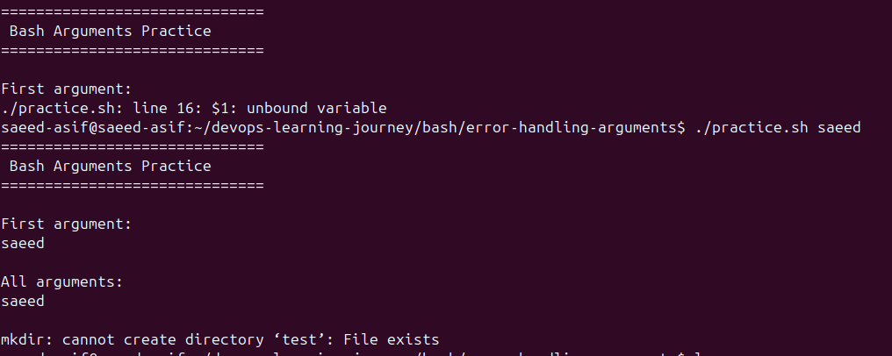

# Bash Error Handling + Arguments

- `set -e` stops script on any command failure  
- `set -u` stops script on undefined variables  
- Helps write safer automation scripts  

- `$1` is the first argument passed to script  
- `$@` contains all arguments passed  

- Running without arguments + `set -u` causes unbound variable error  
- Always check arguments using `$#` before using `$1`  

- `mkdir` fails if folder already exists  
- `mkdir -p` prevents this error safely  

- Arguments make scripts dynamic and reusable  
- Always write defensive bash scripts  

- Learned safe error handling + argument usage  

- Terminal Output:  
  
